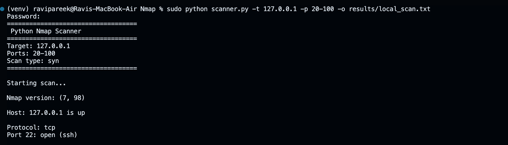

🔍 Python Nmap Scanner

A simple command-line based Nmap scanner written in Python.
This tool automates basic port scanning tasks using Nmap and is intended for learning and authorized penetration testing.

⸻

🚀 Features
	•	Scan open ports on a target
	•	Supports multiple scan types (SYN, UDP, Full scan)
	•	Custom port range
	•	Save scan results to a file
	•	Simple CLI interface

## 📄 Sample Scan Result

Example output from scanning localhost:
Host: 127.0.0.1 is up

Protocol: tcp
Port 22: open (ssh)
Port 80: open (http)

## 🖼️ Demo

